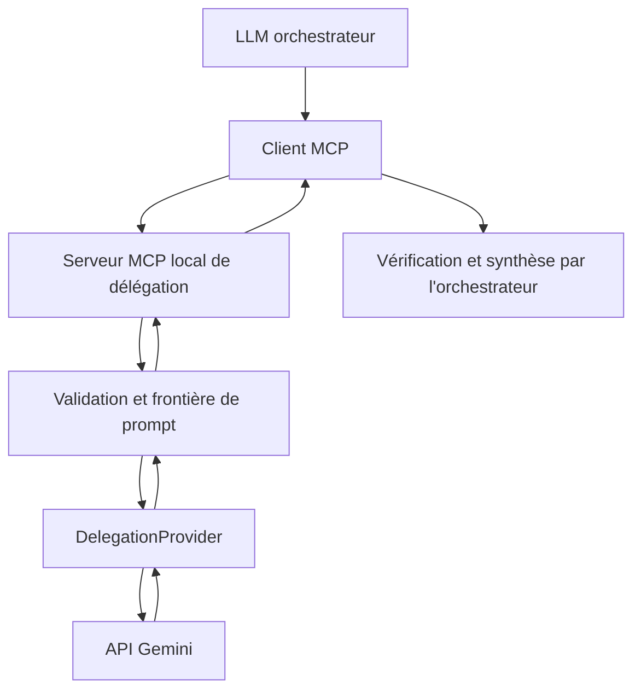

# MCP Cross-Model Delegation

[English](README.md) | Français

**Un pont MCP attentif à la sécurité et un banc d'essai de recherche sur la délégation entre modèles de langage.**

**Statut : expérimental / aperçu de recherche (v0.1.0).** Cet exemple réduit, conçu d'abord pour un usage local, sert à étudier si la délégation de tâches délimitées aide un modèle orchestrateur. Il n'est pas prêt pour la production et ne prétend pas que la délégation améliore la qualité, la vitesse, le coût ou la consommation de tokens. Le premier fournisseur secondaire est Gemini ; le contrat fournisseur permet d'en ajouter d'autres sans modifier les outils MCP.

## Pourquoi ce projet existe

Un orchestrateur peut rencontrer une tâche délimitée ou un long contexte qu'un second modèle pourrait traiter. L'hypothèse est que la délégation **pourrait** réduire la charge de contexte de l'orchestrateur ou améliorer certains traitements spécialisés, mais qu'elle peut aussi ajouter de la latence, des coûts, des risques de confidentialité et une propagation des erreurs. Ce dépôt fournit un pont inspectable et un plan de mesure ; il ne contient aucun résultat expérimental. Voir la [feuille de route de recherche](docs/fr/research-roadmap.md) et le [schéma des benchmarks](benchmarks/benchmark_schema.json).



L'orchestrateur choisit les données à transmettre. Le serveur MCP valide et borne le texte. `GeminiProvider` appelle Gemini. L'orchestrateur doit vérifier la réponse ; le pont ne vérifie pas son exactitude factuelle.

## Outils MCP

| Outil | Entrée | Résultat |
| --- | --- | --- |
| `gemini_delegate_task` | `task` requis, `context` facultatif | `{"model":"...","answer":"..."}` |
| `gemini_extract_findings` | `question` et `context` requis | `summary`, jusqu'à 20 éléments `findings` avec `finding`, `evidence`, `source_label`, `uncertainty` et `model` |

Les deux outils acceptent du **texte fourni par l'appelant**. Ils ne lisent pas automatiquement Google Drive, les e-mails, les fichiers ni les applications de l'utilisateur ; ils n'exécutent pas de code et n'agissent pas dans ces applications. Ils ne garantissent aucune exactitude. Les preuves proposées par Gemini sont des affirmations à comparer au texte original.

Exemples avec données synthétiques :

```text
gemini_delegate_task(task="Calculate 137 × 29 and explain the calculation briefly.")

gemini_extract_findings(
    question="What are the two numbers mentioned and their sum?",
    context="Monday: 12 tickets. Tuesday: 8 tickets."
)
```

## Démarrage rapide

Python 3.12+, [`uv`](https://docs.astral.sh/uv/) et une clé API Gemini sont nécessaires aux vrais appels. Les tests n'ont pas besoin de clé.

```bash
git clone https://github.com/YOUR_GITHUB_USERNAME/mcp-cross-model-delegation.git
cd mcp-cross-model-delegation
cp .env.example .env
# Modifier .env localement et remplacer GEMINI_API_KEY=replace-me par votre clé.
uv sync --extra test
uv run --env-file .env python server.py
```

Le point d'accès MCP en HTTP streamable est `http://127.0.0.1:8000/mcp`. Configurez un client MCP local avec cette adresse. Git ignore `.env`. Ne collez pas la clé dans une commande, une issue, un journal ou un chat. `GEMINI_MODEL` vaut par défaut `gemini-3.5-flash-lite`, modèle stable documenté par Google ; un autre modèle Gemini pris en charge peut être choisi par variable d'environnement. Vérifiez sa disponibilité et son prix dans votre propre projet.

## Développement local et Docker

```bash
uv sync --extra test
uv run pytest -q
uv run ruff check gateway.py server.py providers tests
```

```bash
docker build -t mcp-cross-model-delegation:0.1.0 .
# Exemple de réseau hôte sous Linux ; le serveur MCP reste lié à loopback.
docker run --rm --network host --env-file .env mcp-cross-model-delegation:0.1.0
```

L'image ne contient aucune clé. La prise en charge du réseau hôte varie avec Docker Desktop ; utilisez Python directement si elle n'est pas disponible. Le serveur refuse volontairement `MCP_HOST=0.0.0.0`. Pour fournir un point d'accès réseau, ajoutez une authentification client et une protection du transport adaptées au lieu de supprimer cette garde dans un déploiement partagé.

## Configuration

| Variable | Défaut | Plage sûre ou fonction |
| --- | --- | --- |
| `GEMINI_API_KEY` | requise pour les vrais appels | À garder hors des sources et de l'image |
| `GEMINI_MODEL` | `gemini-3.5-flash-lite` | Identifiant Gemini ; vérifiez vous-même sa disponibilité |
| `MAX_TASK_CHARS` | `12000` | 1–12000 |
| `MAX_CONTEXT_CHARS` | `100000` | 1–200000 |
| `MAX_OUTPUT_TOKENS` | `4096` | 256–8192 |
| `MODEL_TIMEOUT_SECONDS` | `60` | 1–120 |
| `MCP_HOST` | `127.0.0.1` | `127.0.0.1` ou `localhost` uniquement |
| `PORT` | `8000` | 1–65535 |

L'adaptateur Gemini utilise l'API Interactions actuelle avec `store=False`, un délai d'expiration, une sortie bornée et un JSON contraint par schéma pour l'extraction. L'appel SDK est isolé dans `providers/gemini.py` ; `gateway.py` gère la validation et le contrôle des réponses. Les tests utilisent de faux fournisseurs et clients. De futurs fournisseurs OpenAI, Anthropic, Mistral ou locaux pourront implémenter `DelegationProvider` ; aucun ne l'est encore.

## Sécurité et partage des données

**Utiliser l'un des outils transmet à Google la tâche et le contexte fournis.** N'envoyez que les informations dont vous êtes autorisé à disposer ainsi. Les données confidentielles ou personnelles exigent une base juridique, organisationnelle et technique adaptée. Les conditions du fournisseur, la conservation et l'usage des données dépendent du compte et de ses réglages ; consultez la [documentation de l'API Gemini](https://ai.google.dev/gemini-api/docs/logs-datasets) et les conditions applicables. `store=False` désactive la conservation de l'objet Interaction pour chaque requête ; cela ne signifie pas qu'aucun traitement, transport, enregistrement lié au compte ou politique du fournisseur ne s'applique.

**Une frontière entre modèles n'est pas en soi une frontière de sécurité.** TASK et CONTEXT sont encodés dans deux champs JSON distincts, et le prompt indique que les instructions présentes dans CONTEXT ne doivent pas remplacer TASK. Cette séparation réduit le mélange accidentel d'instructions, mais ne garantit pas une résistance aux injections adversariales. Ne déléguez pas de secrets simplement parce que le prompt les appelle « contexte ». L'application ne persiste pas les prompts ou réponses, n'active pas de télémétrie personnalisée et ne journalise pas les charges utiles complètes par défaut. Votre client MCP, votre hôte et le fournisseur peuvent avoir leurs propres journaux.

Le serveur écoute seulement sur loopback et ne possède aucun système d'authentification public. Sa frontière de confiance comprend l'hôte local et le client MCP que vous configurez. Un client, un hôte, une dépendance ou un fournisseur secondaire compromis peut toujours exposer des données ou renvoyer du contenu malveillant. Les échecs transitoires renvoient des objets d'erreur fixes, sans détails sensibles ; ni texte d'exception ni trace de pile ne traversent la frontière MCP. Lisez le [modèle de sécurité](docs/fr/security-model.md) et le [guide de signalement](SECURITY.fr.md).

## Limites et vérification

- La sortie du fournisseur peut être fausse, inventée, incomplète ou malveillante. Vérifiez les réponses importantes et les preuves citées avec des références indépendantes ou le contexte transmis.
- Le pont ne fait aucune recherche web, lecture de fichier, exécution de code ou action externe. Les autres capacités éventuelles du modèle Gemini ne sont pas activées ici.
- Les quotas, pannes, expirations et changements de modèle peuvent interrompre les appels. `MODEL_TEMPORARILY_UNAVAILABLE` autorise un nouvel essai ; des répétitions aveugles peuvent augmenter coût et charge.
- Les limites de caractères et de tokens bornent les requêtes mais n'imposent pas de plafond financier.
- `store=False` ne supprime pas la décision de partager des données avec un tiers.

## Recherche et benchmarks

La [feuille de route](docs/fr/research-roadmap.md) définit les comparaisons orchestrateur seul, délégation libre, délégation structurée, longs contextes, erreur injectée, résistance aux injections, fidélité des preuves et, plus tard, plusieurs fournisseurs. Le [format de benchmark](benchmarks/README.fr.md) enregistre modèles, configuration, tokens, latence, coût estimé, erreurs et provenance de l'évaluation. Aucun résultat n'est revendiqué. Utilisez au besoin des références humaines, des règles déterministes et des évaluateurs indépendants ; le modèle évalué ne doit pas être le seul juge de sa propre réponse.

## Tunnel MCP sécurisé OpenAI facultatif

Un client MCP local suffit pour utiliser ce projet. Le [Secure MCP Tunnel d'OpenAI](https://developers.openai.com/api/docs/guides/secure-mcp-tunnels) est une méthode **facultative** pour connecter un serveur MCP privé sur loopback à un produit OpenAI compatible, sans ouvrir de port entrant. Il nécessite un tunnel et des identifiants créés séparément dans votre propre compte. Ce dépôt n'en contient aucun. Ce tunnel sert aux connexions privées et au mode développeur ; il n'est pas un point d'accès pour soumettre un plugin public. Voir l'[exemple de déploiement générique](docs/fr/deployment-example.md).

## Contribution, licence et avertissement

Voir [CONTRIBUTING.fr.md](CONTRIBUTING.fr.md), [SECURITY.fr.md](SECURITY.fr.md) et le [Code de conduite](CODE_OF_CONDUCT.md). Les modifications substantielles de documentation et de sécurité doivent être répercutées en anglais et en français avant une release. Licence [Apache-2.0](LICENSE).

Cet aperçu de recherche indépendant n'est affilié ni à OpenAI ni à Google. OpenAI est une marque de son propriétaire ; Gemini et Google sont des marques de leurs propriétaires respectifs. Les utilisateurs doivent respecter les conditions des API et services qu'ils choisissent. Aucune garantie de sécurité, d'exactitude, de coût ou de disponibilité n'est fournie.
