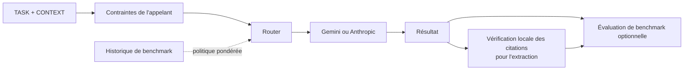

# MCP Cross-Model Delegation

[English](README.md) | Français

[](https://github.com/Jostophe-021/mcp-cross-model-delegation/actions/workflows/tests.yml)
[](https://github.com/Jostophe-021/mcp-cross-model-delegation/actions/workflows/security.yml)

[](LICENSE)

**Un cadre ouvert, reproductible et attentif à la sécurité pour mesurer, comparer, router et vérifier des tâches délimitées entre modèles de langage hétérogènes.**

Un même noyau Python alimente un serveur MCP et une CLI de benchmark : **mesurer → comparer → router → vérifier → améliorer**. La V1 prend en charge Gemini, Anthropic et un fournisseur factice déterministe pour les tests hors ligne. Le routage est explicite, les citations sont vérifiées localement et aucun gain de qualité, de coût ou de latence n'est revendiqué sans mesure.



## Ce que vous pouvez faire aujourd'hui

- Déléguer une tâche textuelle délimitée à Gemini ou Anthropic avec la même interface.
- Appliquer des contraintes de confidentialité, capacité, coût et latence avant la sélection ; inspecter les raisons du choix.
- Vérifier les citations extraites dans le contexte fourni.
- Lancer des benchmarks hors ligne sans clé API, ou activer explicitement des expériences entre fournisseurs réels.

## Pourquoi ce projet est différent

La même boucle mesure, route, exécute, vérifie les preuves et évalue les résultats. La politique par défaut est `manual` ; `rules` et `benchmark_weighted` demandent un choix explicite. Un score historique ne garantit ni la latence ni la qualité future. Voir l'[architecture](docs/fr/architecture.md), la [méthodologie](docs/fr/methodology.md) et les [cas d'usage](docs/fr/use-cases.md).

## Essayer en cinq minutes

Python 3.12 ou 3.13 et [uv](https://docs.astral.sh/uv/) sont pris en charge. Les clés API Gemini et Anthropic sont indépendantes : configurez l'une ou les deux. Un abonnement Claude ne fournit pas de crédits API Anthropic.

```bash
git clone https://github.com/Jostophe-021/mcp-cross-model-delegation.git
cd mcp-cross-model-delegation
uv sync --locked --extra all --extra test
uv run crossmodel doctor
uv run crossmodel providers
uv run crossmodel bench run benchmarks/datasets/basic.jsonl
```

Ce benchmark utilise `FakeProvider` et ne demande aucune clé API. **Validation du logiciel uniquement — pas un résultat de performance des LLM.** Voir les [quatre exemples hors ligne](examples/README.md).

## Essayer un vrai fournisseur

Définissez `GEMINI_API_KEY` ou `ANTHROPIC_API_KEY` seulement si vous souhaitez appeler un vrai fournisseur. **Les appels API réels peuvent être facturés.** Commencez avec du texte synthétique ou redistribuable et vérifiez le nombre d'appels prévu avant un benchmark réel.

Depuis ce dépôt, installez seulement l'adaptateur nécessaire avec `uv sync --locked --extra gemini` ou `uv sync --locked --extra anthropic`. Le paquet de base n'exige aucun des deux SDK pour les benchmarks hors ligne. La publication PyPI est une étape distincte ; installez depuis le dépôt tant qu'une publication PyPI n'est pas vérifiée.

Définissez `GEMINI_API_KEY` et/ou `ANTHROPIC_API_KEY` dans votre environnement. `.env.example` n'a que des exemples ; ne commitez jamais `.env` et ne collez pas de clé dans une commande, issue ou conversation. Définissez `DEFAULT_PROVIDER=anthropic` pour choisir Anthropic par défaut en mode manuel. `crossmodel serve` expose MCP HTTP à `http://127.0.0.1:8000/mcp`. `MCP_HOST=0.0.0.0` est refusé faute d'authentification publique.

## Outils MCP

| Outil | Rôle |
| --- | --- |
| `delegate_task` | Déléguer une TASK avec CONTEXT, fournisseur, politique et contraintes optionnels. |
| `extract_findings` | Extraire des résultats structurés et localiser les citations dans CONTEXT. |
| `gemini_delegate_task`, `gemini_extract_findings` | Alias compatibles V0.1, Gemini et politique manuelle. |

Les outils génériques utilisent `policy="manual"` par défaut. `provider` suit `DEFAULT_PROVIDER`, puis Gemini si configuré, puis le premier fournisseur configuré. Activez explicitement `policy="rules"` ou `policy="benchmark_weighted"`. Pour le routage pondéré dans MCP, l'opérateur définit `CROSSMODEL_HISTORY_PATH` vers un fichier local/public `history.json` issu d'un benchmark ; l'appelant ne choisit pas le chemin. Les contraintes comprennent `allowed_providers`, `privacy_mode`, `approved_providers`, `max_cost`, `max_latency`, `require_structured_output`, `require_evidence`, `fallback_allowed` et `allow_unknown_cost`. Un plafond strict rejette les coûts ou latences inconnus. `privacy_mode="local_only"` rejette les deux fournisseurs externes inclus avec `NO_ELIGIBLE_PROVIDER`.

Ces outils ne traitent que le texte fourni par l'appelant. Ils ne lisent ni fichiers, ni e-mails, ni Drive, ni applications ; ils n'exécutent pas de code et n'agissent pas dans d'autres services. L'appelant décide quelles données quittent sa machine. TASK et CONTEXT restent des champs JSON distincts ; les instructions dans CONTEXT ne sont pas fiables. C'est une **atténuation, pas une garantie de sécurité**. Voir le [modèle de sécurité](docs/fr/security-model.md).

## Expliquer une décision

```bash
crossmodel route explain --policy rules --constraints '{"privacy_mode":"external_allowed"}'
crossmodel route explain --provider gemini --policy manual
crossmodel route explain --policy benchmark_weighted --history results/<run-id>/history.json
```

Aucun appel API n'est effectué. La commande affiche les fournisseurs admissibles ou rejetés, les codes de raison, la chaîne de repli et les composantes du score. Seules les métriques mesurées et communes aux candidats sont utilisées ; les valeurs manquantes restent `null`.

## Benchmark

Par défaut, `FakeProvider` n'appelle aucune API payante. Ses résultats vérifient le logiciel, **pas des hypothèses scientifiques sur les LLM**.

```bash
crossmodel bench run benchmarks/datasets/basic.jsonl
crossmodel bench report results/<run-id>
crossmodel bench generate /tmp/long.jsonl --size medium --seed 42
```

Chaque exécution produit `manifest.json`, `results.jsonl`, `summary.json` et `history.json`. Les résultats omettent TASK, CONTEXT et les réponses par défaut ; ils contiennent un SHA-256 du contexte exact. Le jeu de données contient six petites tâches synthétiques : arithmétique, extraction, preuves, injection de prompt, erreur et long contexte. Le générateur enregistre caractères, seed et version ; les tokens restent `null` avant mesure.

Pour une expérience API, utilisez `--live --provider gemini --orchestrator anthropic` avec vos fournisseurs configurés. La CLI affiche le plan d'appels avant l'exécution. `--repetitions N --shuffle --seed 42` contrôle les répétitions et l'ordre ; la concurrence vaut un. Le coût reste `unavailable` sans source tarifaire datée. `--save-responses` écrit réponses et résultats bruts : ne l'utilisez qu'avec des données redistribuables. Les quatre conditions sont `orchestrator_only`, `fixed_delegation`, `structured_delegation` et `routed_delegation`. V1 mesure un appel par condition, sans seconde étape de synthèse par l'orchestrateur. Voir le [format de benchmark](benchmarks/README.fr.md) et la [méthodologie](docs/fr/methodology.md).

## Développement et image

```bash
uv sync --locked --extra all --extra test
uv run pytest -q
uv run ruff check gateway.py server.py contracts.py routing.py execution.py evidence.py cli.py providers benchmarks tests
uv build
docker build -t mcp-cross-model-delegation:1.0.0 .
```

L'image ne contient aucune clé. Sous Linux, `docker run --rm --network host --env-file .env mcp-cross-model-delegation:1.0.0` conserve l'écoute sur loopback ; le réseau hôte de Docker Desktop varie selon la plateforme. Le workflow de release publie `ghcr.io/jostophe-021/mcp-cross-model-delegation:1.0.0` avec les métadonnées OCI et une SBOM SPDX. Le [Secure MCP Tunnel d'OpenAI](https://developers.openai.com/api/docs/guides/secure-mcp-tunnels) est facultatif pour un client distant compatible ; ce dépôt ne contient aucun identifiant de tunnel ni secret.

## MCP Registry

La version `1.0.0` a été acceptée par l'outil officiel de publication MCP Registry sous le nom `io.github.Jostophe-021/mcp-cross-model-delegation`. Le paquet déclaré est l'[image GHCR publique](https://github.com/Jostophe-021/mcp-cross-model-delegation/pkgs/container/mcp-cross-model-delegation). Le Registry reste un service en préversion ; vérifiez son entrée actuelle avant de dépendre de la découverte.

## Recherche

Le projet sert à étudier quand la délégation aide, quand elle n'aide pas et quels compromis elle introduit. Commencez par la [méthodologie](docs/fr/methodology.md), la [feuille de route](docs/fr/research-roadmap.md), le [jeu synthétique et le format de benchmark](benchmarks/README.fr.md), le [schéma des résultats](benchmarks/result_schema.json) et le [guide de première expérience](docs/fr/first-experiment.md). Publiez uniquement des résultats bruts non sensibles, une synthèse et les limites ; citez la version avec [CITATION.cff](CITATION.cff).

## Créer votre propre version

```text
Fork → Fournisseur / Politique / Évaluateur / Jeu de données → Votre dérivé
                                                        ↘ Contribution amont facultative
```

Le [guide d'extension](docs/fr/extending.md) présente les interfaces V1 et leurs limites. Le [guide de contribution](CONTRIBUTING.fr.md) explique comment suivre l'amont.

## Forks et projets dérivés

Les forks et adaptations sont bienvenus. Sur GitHub, la fonction **Fork** rend visible le lien avec le dépôt d'origine. Les projets dérivés indépendants sont également permis par Apache-2.0, sous réserve de ses obligations de licence et d'attribution applicables. Les améliorations génériques sont bienvenues en amont ; les forks restent libres de diverger. Conservez les fichiers [LICENSE](LICENSE) et [NOTICE](NOTICE) applicables, indiquez vos changements et citez le projet d'origine si pertinent.

## Travaux liés et aide

La délégation générique entre modèles est antérieure à ce projet. La page [travaux liés](docs/fr/related-work.md) renvoie vers des ponts, systèmes multifournisseurs, routeurs et outils d'évaluation. Pour l'usage et la recherche, voir [SUPPORT.md](SUPPORT.md) et les [Discussions](https://github.com/Jostophe-021/mcp-cross-model-delegation/discussions) ; signalez les vulnérabilités par [voie privée](SECURITY.fr.md).

## Ce que ce projet n'est pas

- Une affirmation selon laquelle la délégation améliore toujours les résultats ou qu'un fournisseur est supérieur partout.
- Une plateforme d'agents autonomes, une frontière de sécurité suffisante en production ou une garantie contre l'injection de prompt.
- Un produit officiel d'OpenAI, d'Anthropic ou de Google.

Aucune télémétrie personnalisée n'est activée. Les tokens, coûts ou qualités inconnus restent inconnus. Voir la [feuille de route](docs/fr/research-roadmap.md), le [changelog](CHANGELOG.md), le [guide de contribution](CONTRIBUTING.fr.md), les [Discussions](https://github.com/Jostophe-021/mcp-cross-model-delegation/discussions) et les [informations de citation](CITATION.cff). Licence [Apache-2.0](LICENSE).
