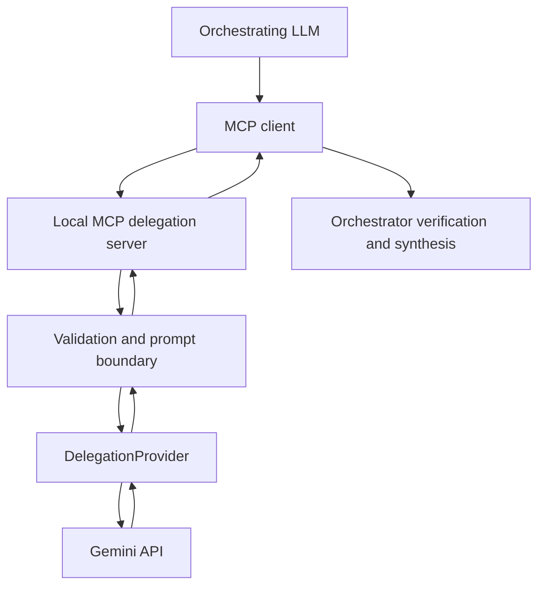

# MCP Cross-Model Delegation

English | [Français](README.fr.md)

**A security-conscious MCP bridge and research testbed for cross-model LLM delegation.**

**Status: Experimental / Research Preview (v0.1.0).** This is a small, local-first example for studying whether bounded delegation helps an orchestrating model. It is not production-ready and does not claim that delegation improves quality, speed, cost, or token use. The first secondary provider is Gemini; the provider contract permits future implementations without changing the MCP tools.

## Why this project exists

An orchestrator sometimes has a bounded task or a long context that a second model could process. The hypothesis is that delegation **may** reduce orchestrator context load or improve specialized processing, but may also add latency, cost, privacy risk, and error propagation. This repository supplies an inspectable bridge and a measurement plan; it contains no experimental results. See the [research roadmap](docs/en/research-roadmap.md) and [benchmark schema](benchmarks/benchmark_schema.json).



The orchestrator chooses what to send. The MCP server validates and bounds text. `GeminiProvider` calls Gemini. The orchestrator must verify the returned answer; the bridge does not verify factual accuracy.

## MCP tools

| Tool | Input | Result |
| --- | --- | --- |
| `gemini_delegate_task` | Required `task`, optional `context` | `{"model":"...","answer":"..."}` |
| `gemini_extract_findings` | Required `question` and `context` | `summary`, up to 20 `findings` with `finding`, `evidence`, `source_label`, `uncertainty`, and `model` |

Both tools accept **text provided by the caller**. They do not automatically read Google Drive, email, files, or user applications; execute code; or take actions in those applications. They cannot guarantee correctness. Treat evidence returned by Gemini as a claim to check against the original text.

Example calls with synthetic data:

```text
gemini_delegate_task(task="Calculate 137 × 29 and explain the calculation briefly.")

gemini_extract_findings(
    question="What are the two numbers mentioned and their sum?",
    context="Monday: 12 tickets. Tuesday: 8 tickets."
)
```

## Quick start

Requires Python 3.12+, [`uv`](https://docs.astral.sh/uv/), and a Gemini API key for real calls. Tests need no key.

```bash
git clone https://github.com/YOUR_GITHUB_USERNAME/mcp-cross-model-delegation.git
cd mcp-cross-model-delegation
cp .env.example .env
# Edit .env locally and replace GEMINI_API_KEY=replace-me with your own key.
uv sync --extra test
uv run --env-file .env python server.py
```

The streamable HTTP MCP endpoint is `http://127.0.0.1:8000/mcp`. Point a local MCP client at it. `.env` is ignored by Git. Do not paste your key into a command, issue, log, or chat. `GEMINI_MODEL` defaults to Google's documented stable `gemini-3.5-flash-lite`; users can choose another supported Gemini model through the environment. Confirm model availability and pricing for your own project.

## Local development and Docker

```bash
uv sync --extra test
uv run pytest -q
uv run ruff check gateway.py server.py providers tests
```

```bash
docker build -t mcp-cross-model-delegation:0.1.0 .
# Linux host networking example; the MCP listener remains loopback-only.
docker run --rm --network host --env-file .env mcp-cross-model-delegation:0.1.0
```

The image contains no key. Docker Desktop host networking varies by platform; use a local Python run when host networking is unavailable. The server deliberately refuses `MCP_HOST=0.0.0.0`. To offer a network endpoint, add suitable client authentication and transport security rather than changing this guard in a shared deployment.

## Configuration

| Variable | Default | Safe range or purpose |
| --- | --- | --- |
| `GEMINI_API_KEY` | required for real calls | Keep outside source and image |
| `GEMINI_MODEL` | `gemini-3.5-flash-lite` | Gemini model ID; validate availability yourself |
| `MAX_TASK_CHARS` | `12000` | 1–12000 |
| `MAX_CONTEXT_CHARS` | `100000` | 1–200000 |
| `MAX_OUTPUT_TOKENS` | `4096` | 256–8192 |
| `MODEL_TIMEOUT_SECONDS` | `60` | 1–120 |
| `MCP_HOST` | `127.0.0.1` | `127.0.0.1` or `localhost` only |
| `PORT` | `8000` | 1–65535 |

The Gemini adapter uses the current Interactions API with `store=False`, a request timeout, a bounded output, and schema-constrained JSON for extraction. The SDK call is isolated in `providers/gemini.py`; `gateway.py` handles validation and result checks. A fake provider/client is used in tests. Future OpenAI, Anthropic, Mistral, or local providers can implement `DelegationProvider`; none is implemented yet.

## Security and data sharing

**Using either tool transmits the supplied task and context to Google.** Send only information you are authorized to share. Confidential and personal data require a suitable legal, organizational, and technical basis. Provider terms, retention, and data-use rules depend on the account and settings; consult the [Gemini API documentation](https://ai.google.dev/gemini-api/docs/logs-datasets) and applicable terms. `store=False` opts out of Interactions object storage for each request; it is not a promise that no processing, transport, account-level record, or provider policy applies.

**A model boundary is not a security boundary by itself.** TASK and CONTEXT are encoded as separate JSON fields, and the prompt says that instructions in CONTEXT must not override TASK. This reduces accidental instruction mixing but does not guarantee resistance to adversarial prompt injection. Do not delegate secrets merely because the prompt labels them as context. The application does not persist prompts or responses, enable custom telemetry, or log full payloads by default. Your MCP client, host, and provider may have independent logs.

The server binds only to loopback and has no public authentication system. Its trusted boundary is the local host and the MCP client you configure. A compromised client, host, dependency, or secondary provider can still expose data or return malicious content. Transient provider failures return fixed, non-sensitive error objects; no exception text or stack trace crosses the MCP boundary. Read the [security model](docs/en/security-model.md) and [security reporting guide](SECURITY.md).

## Limitations and verification

- Provider output may be wrong, fabricated, incomplete, or malicious. Check important answers and quoted evidence against independent references or the supplied context.
- The bridge performs no web retrieval, file access, code execution, or external action. Model capabilities available through other Gemini tools are not enabled here.
- Rate limits, outages, timeouts, and model changes can interrupt calls. `MODEL_TEMPORARILY_UNAVAILABLE` is retryable; repeated blind retries may increase cost and load.
- Character and output-token limits bound requests but do not enforce a monetary cap.
- `store=False` does not remove the third-party data-sharing decision.

## Research and benchmarks

The [roadmap](docs/en/research-roadmap.md) defines orchestrator-only, unstructured delegation, structured delegation, long-context, injected-error, injection-resistance, evidence-fidelity, and future cross-provider comparisons. The [benchmark format](benchmarks/README.md) records models, configuration, token usage, latency, cost estimate, errors, and evaluation provenance. No benchmark outcome is claimed. Human references, deterministic rules, and independent evaluators should be used where appropriate; the model under test must not be the sole judge of its own answer.

## Optional OpenAI Secure MCP Tunnel

A local MCP client is enough to run this project. [OpenAI Secure MCP Tunnel](https://developers.openai.com/api/docs/guides/secure-mcp-tunnels) is an **optional** way to connect a private loopback MCP server to a supported OpenAI product without opening an inbound port. It requires a separately created tunnel and credentials under your own account. This repository contains none. The tunnel is for private/developer-mode connectivity and is not a public plugin-submission endpoint. See the [generic deployment example](docs/en/deployment-example.md).

## Contributing, license, and disclaimer

See [CONTRIBUTING.md](CONTRIBUTING.md), [SECURITY.md](SECURITY.md), and the [Code of Conduct](CODE_OF_CONDUCT.md). Substantive documentation and safety changes should be reflected in English and French before a release. Licensed under [Apache-2.0](LICENSE).

This independent research preview is not affiliated with OpenAI or Google. OpenAI is a trademark of its owner; Gemini and Google are trademarks of their respective owners. Users must comply with the terms of the APIs and services they choose. No security, accuracy, cost, or availability guarantee is provided.
