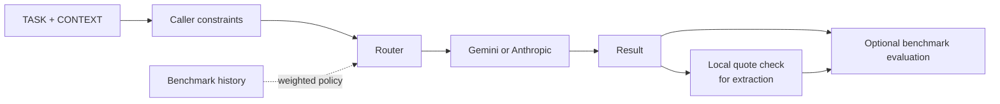

# MCP Cross-Model Delegation

English | [Français](README.fr.md)

[](https://github.com/Jostophe-021/mcp-cross-model-delegation/releases/latest)
[](https://github.com/Jostophe-021/mcp-cross-model-delegation/actions/workflows/tests.yml)
[](https://github.com/Jostophe-021/mcp-cross-model-delegation/actions/workflows/security.yml)

[](LICENSE)

**An open, reproducible and security-conscious framework for measuring, comparing, routing and verifying bounded work across heterogeneous language models.**

One Python core powers an MCP server and a benchmark CLI: **measure → compare → route → verify → improve**. V1 supports Gemini, Anthropic, and a deterministic fake provider for offline tests. Routing is explicit, quotation evidence is checked locally, and no improvement in quality, cost, or latency is claimed without measurement.



## What you can do today

- Delegate bounded text work to Gemini or Anthropic through one interface.
- Apply privacy, capability, cost, and latency constraints before provider selection; inspect routing reasons.
- Verify extracted quotations against the supplied context.
- Run deterministic offline benchmarks without API keys, or opt in to live cross-provider experiments.

## Why this is different

The same loop measures, routes, executes, verifies evidence, and evaluates results. The default policy is manual; `rules` and `benchmark_weighted` require explicit opt-in. Historical scores do not promise future quality or latency. See the [architecture](docs/en/architecture.md), [methodology](docs/en/methodology.md), and [use cases](docs/en/use-cases.md).

## Install and run

Python 3.12 or 3.13 and [uv](https://docs.astral.sh/uv/) are supported. A Gemini API key and an Anthropic API key are independent; configure either or both. A Claude subscription does not provide Anthropic API credits.

```bash
git clone https://github.com/Jostophe-021/mcp-cross-model-delegation.git
cd mcp-cross-model-delegation
uv sync --locked --extra all --extra test
source .venv/bin/activate
crossmodel doctor
crossmodel providers
crossmodel bench run benchmarks/datasets/basic.jsonl
```

The benchmark above uses `FakeProvider` and needs no API key. Set `GEMINI_API_KEY` or `ANTHROPIC_API_KEY` only when you want to call a real provider.

Or install only the needed adapter: `pip install "mcp-cross-model-delegation[gemini]"` or `pip install "mcp-cross-model-delegation[anthropic]"`. The base package needs neither provider SDK for offline benchmarks. PyPI publication is a separate release step; until then, install from the repository with `uv sync`.

Set `GEMINI_API_KEY` and/or `ANTHROPIC_API_KEY` in your own environment. `.env.example` shows names only; never commit `.env` or paste a key into a command, issue, or chat. Set `DEFAULT_PROVIDER=anthropic` if Anthropic is your manual default. Run `crossmodel serve` to expose streamable HTTP MCP at `http://127.0.0.1:8000/mcp`. `MCP_HOST=0.0.0.0` is refused because the server has no public client authentication.

## MCP tools

| Tool | Purpose |
| --- | --- |
| `delegate_task` | Delegate a bounded TASK with optional CONTEXT, provider, policy, and constraints. |
| `extract_findings` | Extract structured findings, then locate quotations locally in CONTEXT. |
| `gemini_delegate_task`, `gemini_extract_findings` | V0.1 compatibility aliases using Gemini and manual routing. |

Generic tools default to `policy="manual"`. `provider` follows `DEFAULT_PROVIDER`, then Gemini if configured, then the first configured provider. Opt in to `policy="rules"` or `policy="benchmark_weighted"`. For weighted routing in MCP, the server operator sets `CROSSMODEL_HISTORY_PATH` to a local/public `history.json` produced by a benchmark; callers cannot choose a file path. Constraints include `allowed_providers`, `privacy_mode`, `approved_providers`, `max_cost`, `max_latency`, `require_structured_output`, `require_evidence`, `fallback_allowed`, and explicit `allow_unknown_cost`. A strict cost or latency cap rejects unknown values. `privacy_mode="local_only"` rejects both included external providers with `NO_ELIGIBLE_PROVIDER`.

The tools accept only caller-supplied text. They do not read files, email, Drive, or apps, execute code, or take actions in other services. The caller decides what may leave the machine. TASK and CONTEXT remain distinct JSON fields; instructions in CONTEXT are untrusted. This is a **mitigation, not a security guarantee**. The [security model](docs/en/security-model.md) details the limits.

## Explain a route

```bash
crossmodel route explain --policy rules --constraints '{"privacy_mode":"external_allowed"}'
crossmodel route explain --provider gemini --policy manual
crossmodel route explain --policy benchmark_weighted --history results/<run-id>/history.json
```

This makes no API call. It prints eligible and rejected providers, reason codes, fallback chain, and score components. Only measured common metrics are scored; missing values remain `null`.

## Benchmark

The default run uses only `FakeProvider`; it never calls a paid API. It tests software behavior, **not LLM research hypotheses**.

```bash
crossmodel bench run benchmarks/datasets/basic.jsonl
crossmodel bench report results/<run-id>
crossmodel bench generate /tmp/long.jsonl --size medium --seed 42
```

Each run writes `manifest.json`, `results.jsonl`, `summary.json`, and `history.json`. Results omit TASK, CONTEXT, and responses by default; they include a SHA-256 of the exact context used. The dataset contains small, manually audited synthetic arithmetic, extraction, evidence, prompt-injection, error-detection, and long-context tasks. Generated long contexts record characters, seed, generator version, and `tokens: null` until measured.

For live experiments, use `--live --provider gemini --orchestrator anthropic` (or your configured providers). The CLI prints providers, conditions, task count, repetitions, and planned API calls before execution. Use `--repetitions N --shuffle --seed 42` to repeat and randomize condition order. Concurrency is one. Cost is `unavailable` without a separate dated pricing source; no price is hardcoded. `--save-responses` writes raw answers and findings, so use it only with redistributable data. The four conditions are `orchestrator_only`, `fixed_delegation`, `structured_delegation`, and `routed_delegation`; V1 measures one model call per condition and does not implement a second orchestrator synthesis call. See [benchmark format](benchmarks/README.md) and [methodology](docs/en/methodology.md).

## Develop and build

```bash
uv sync --locked --extra all --extra test
uv run pytest -q
uv run ruff check gateway.py server.py contracts.py routing.py execution.py evidence.py cli.py providers benchmarks tests
uv build
docker build -t mcp-cross-model-delegation:1.0.0 .
```

The Docker image contains no API keys. Under Linux, `docker run --rm --network host --env-file .env mcp-cross-model-delegation:1.0.0` keeps the MCP listener on host loopback. Docker Desktop host networking varies; local Python is the simpler option. The future public OCI tag is `ghcr.io/jostophe-021/mcp-cross-model-delegation:1.0.0`; its release workflow adds an SPDX SBOM. The optional [OpenAI Secure MCP Tunnel](https://developers.openai.com/api/docs/guides/secure-mcp-tunnels) can connect a compatible remote client without opening an inbound port; this repository includes no tunnel identifier or credential.

## This is not

- A claim that multi-model delegation always helps or one provider is universally superior.
- An autonomous agent platform, a production security boundary by itself, or a prompt-injection guarantee.
- An official OpenAI, Anthropic, or Google product.

No custom telemetry is enabled. Unknown token usage, cost, and quality remain unknown. See the [research roadmap](docs/en/research-roadmap.md), [changelog](CHANGELOG.md), [contributing guide](CONTRIBUTING.md), [Discussions](https://github.com/Jostophe-021/mcp-cross-model-delegation/discussions), and [citation metadata](CITATION.cff). The code is under [Apache-2.0](LICENSE).
