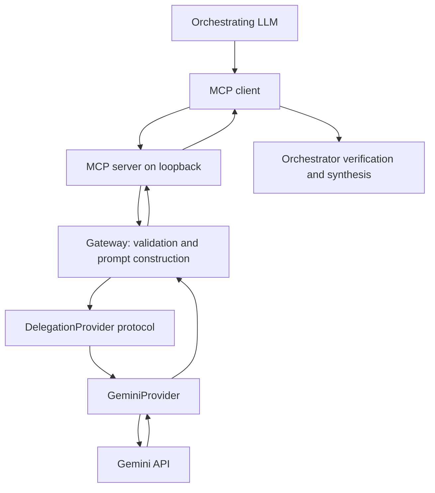

# Architecture

English | [Français](../fr/architecture.md)

The MCP client and local host are inside the deployment's first trust boundary. `server.py` exposes two read-only text tools over streamable HTTP at `/mcp`, with a loopback-only default. It does not authenticate clients, so a remote listener is refused. `gateway.py` validates types, strips and bounds inputs, separates TASK and CONTEXT in JSON, checks outputs, and maps failures to fixed public errors. `providers/base.py` defines `DelegationProvider`; `providers/gemini.py` owns all Gemini SDK calls. The Gemini API is a third-party trust boundary. The orchestrator decides whether to send data and must verify responses.

The current adapter uses stateless Interactions calls with `store=False`, timeout, low thinking level, output-token cap, and JSON-schema response format for extraction. These calls do not enable Gemini's external tools. No database, custom telemetry, or prompt/response persistence is implemented. The provider contract is intentionally small; future provider-specific model settings belong behind the adapter, while common input and output rules remain in the gateway.

An optional private tunnel can transport requests from a compatible remote MCP client to this local endpoint. It changes connectivity, not the data-sharing decision or Gemini trust boundary. See [deployment-example.md](deployment-example.md) and [security-model.md](security-model.md).
