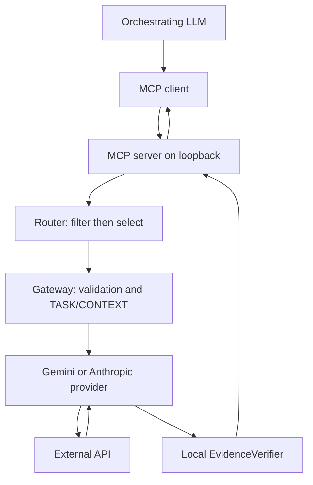

# Architecture

English | [Français](../fr/architecture.md)

The MCP client and local host are inside the deployment's first trust boundary. `server.py` exposes four text tools over streamable HTTP at `/mcp`: two generic tools and two Gemini compatibility aliases. It does not authenticate clients, so a remote listener is refused. `routing.py` filters configured providers by privacy, capabilities, and strict cost/latency limits before applying `manual`, `rules`, or `benchmark_weighted`. The Router never calls an API. `execution.py` then uses the selected adapter and can use one explicit fallback after a retryable error. Its trace contains decision, provider, latency, error, and source hash, but no prompt or full response.

`gateway.py` validates and bounds inputs, separates TASK and CONTEXT in JSON, checks outputs, and maps failures to fixed public errors. `providers/base.py` defines the short `DelegationProvider` contract. The Gemini adapter uses stateless Interactions with `store=False`; the Anthropic adapter uses Messages with SDK retries disabled. Neither adapter enables external model tools. `evidence.py` computes exact or whitespace-normalized quotation spans and a SHA-256 of CONTEXT. This verifies textual presence, not factual truth. `benchmarks/runner.py` uses these same Router/executor primitives, plus deterministic evaluators and JSONL files. No database, custom telemetry, or prompt/response persistence is required.

An optional private tunnel can transport requests from a compatible remote MCP client to this local endpoint. It changes connectivity, not the data-sharing decision or provider trust boundary. See [deployment-example.md](deployment-example.md), [security-model.md](security-model.md), and [methodology.md](methodology.md).
