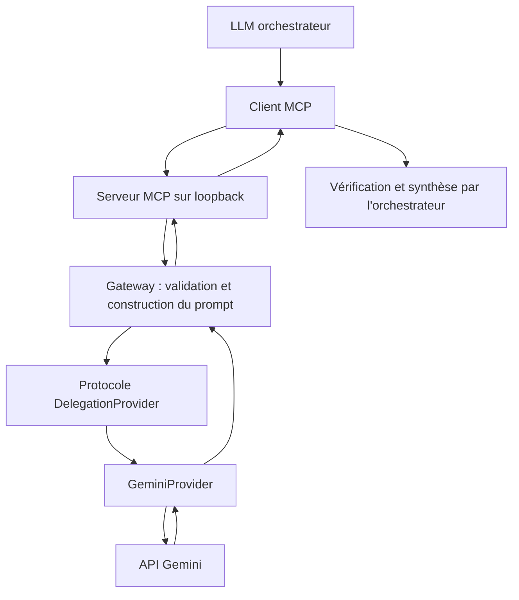

# Architecture

[English](../en/architecture.md) | Français

Le client MCP et l'hôte local forment la première frontière de confiance du déploiement. `server.py` expose deux outils textuels en lecture seule en HTTP streamable sur `/mcp`, avec écoute locale par défaut. Il n'authentifie pas les clients ; une écoute distante est donc refusée. `gateway.py` valide les types, nettoie et borne les entrées, sépare TASK et CONTEXT en JSON, contrôle les sorties et transforme les échecs en erreurs publiques fixes. `providers/base.py` définit `DelegationProvider` ; `providers/gemini.py` contient tous les appels au SDK Gemini. L'API Gemini est une frontière de confiance tierce. L'orchestrateur décide des données à envoyer et doit vérifier les réponses.

L'adaptateur actuel utilise des appels Interactions sans état, avec `store=False`, un délai d'expiration, un niveau de raisonnement bas, une limite de tokens en sortie et un schéma JSON pour l'extraction. Ces appels n'activent pas les outils externes de Gemini. Aucune base de données, télémétrie personnalisée ni conservation des prompts ou réponses n'est implémentée. Le contrat fournisseur reste volontairement petit ; les futurs réglages propres aux fournisseurs doivent rester derrière l'adaptateur, tandis que les règles communes d'entrée et de sortie restent dans la gateway.

Un tunnel privé facultatif peut transporter les requêtes d'un client MCP distant compatible vers ce point d'accès local. Il modifie la connectivité, pas la décision de partager des données ni la frontière de confiance Gemini. Voir [deployment-example.md](deployment-example.md) et [security-model.md](security-model.md).
