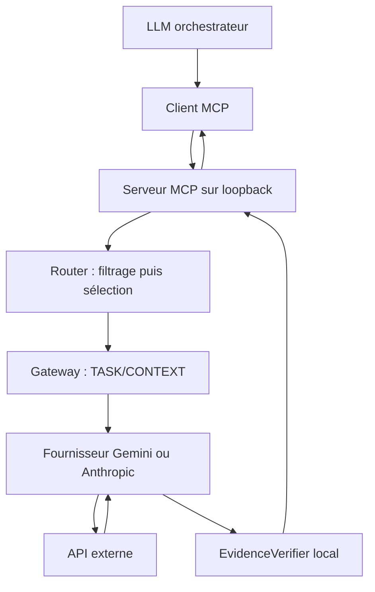

# Architecture

[English](../en/architecture.md) | Français

Le client MCP et l'hôte local forment la première frontière de confiance. `server.py` expose deux outils génériques et deux alias Gemini sur `/mcp`, avec écoute locale sans authentification publique. `routing.py` filtre les fournisseurs par confidentialité, capacités, coût et latence avant `manual`, `rules` ou `benchmark_weighted`. Le Router ne fait aucun appel API. `execution.py` utilise ensuite l'adaptateur retenu et peut effectuer un repli explicite après une erreur réessayable. Sa trace contient décision, fournisseur, latence, erreur et hash de source, mais ni prompt ni réponse complète.

`gateway.py` valide et borne les entrées, sépare TASK et CONTEXT en JSON, vérifie les sorties et assainit les erreurs. `providers/base.py` définit un contrat court. Gemini utilise Interactions avec `store=False` ; Anthropic utilise Messages sans retries SDK. Aucun outil externe de modèle n'est activé. `evidence.py` calcule les offsets des citations exactes ou normalisées et le SHA-256 de CONTEXT : la présence textuelle ne prouve pas la vérité. Le benchmark emploie les mêmes primitives Router/exécution. Aucune base de données, télémétrie personnalisée ni conservation obligatoire des prompts/réponses.

Un tunnel privé facultatif peut relier un client MCP distant compatible à ce point d'accès local. Il change la connectivité, pas la décision de partager les données. Voir [deployment-example.md](deployment-example.md), [security-model.md](security-model.md) et [methodology.md](methodology.md).
